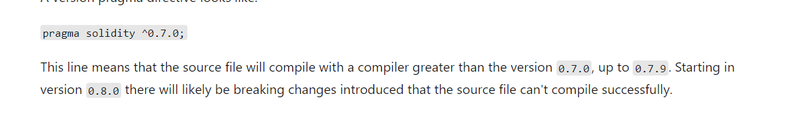
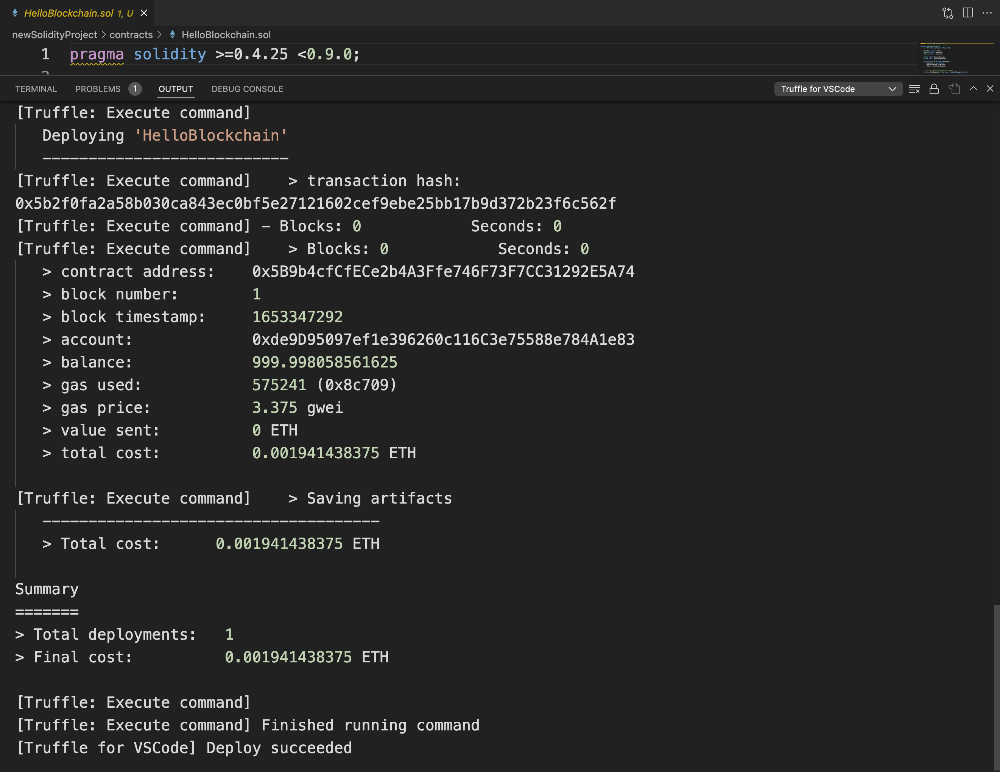
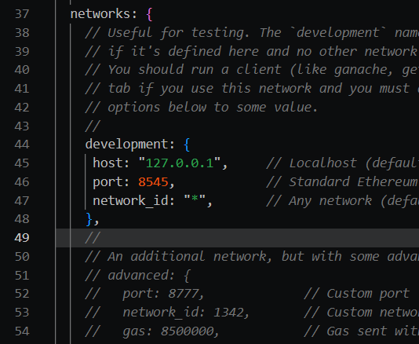

* Blockchain lets you implement a business process when you need to trust data and participants without using a central database.
* blockchain relies on cryptography so its hard to change history of data
* coins are physcal pieces of ownership, you give the coin to a friend, it is now theirs
* in blockchain, say you transfer ownership that fact beomes a node that updates all ledgers
  * facts are validated by consensus of the ledger, if the coin is not yours it cant also be someone elses
  * each block in the block- chain ends up being turned into a sha-256 hash
  * blockchain uses hashes to determine if there has been any change made
* so A __decentralized application (DApp)__ is an application on a distributed computing system
  * Ethereum DApps are called smart contracts.
  * __Ethereum DApps__ contains logic parts of a transaction
  * you use Solidity to program this logic
  * to use an __Ethereum DApp__ you make an instance so  __Ethereum DApp__ is like a class, with metadata about the item and fns to say transfer ownership
  * __Ethereum DApp__ is immutable


## Blockchain Types
* public or private to people

### Public
* no trust

### Private
* partial trust, transactions are validation against a consortium

### Blockchain protocols
* bitcoin is one of the several blockchain protocols
* use  Ethereum and Hyperledger Fabric if you have your own solition

## When to use blockchain
* how many participants, do we want to avoid central trust, do we rely on synchornize
* how much business logic is needed when doing a transction, if its high dont use blockchain?
* when the business logic is very static, changes requires new etherum DApps which are expensinve

## Blockchain options on Azure
* __templates__ are like your own custom blockchain
* __Azure Blockchain Workbench__ is for development testing and getting used to blockchain development


# Learn How To Use Solidity
* solidity is a language for writing smart contracts logistics environment if you will

## What is Solidity
* __Solidity__ is an object-oriented language for writing smart contracts.
* Solidity smart contracts will be deployed to and run in a virtual environment.
* Ethereum is one of the most popular blockchain platforms, 

## Understand the language basics
* to get around in solidity
  * Pragma directives
  * State variables
  * Functions
  * Events

### Pragma directives

__Pragma__ is the keyword that you use to ask the compiler to check whether its version of Solidity matches the one required.
* make sure you are using the latest version of [solidity](https://docs.soliditylang.org/en/v0.8.15/)



### State variables
State variables are key to any Solidity source file. State variable values are stored in contract storage permanently.
```sol
pragma solidity >0.7.0 <0.8.0;

contract Marketplace {
    uint price; // State variable
```
* Contract source files always start with the definition contract ContractName.

state variable visibility specifiers
* public: part of the contract interface and can be accessed from other contracts.
* internal: only accessed internally from the current contract.
* private: only visible for the contract it's defined in.

### Functions
* just the same in other languages
* visibility specifiers: public, private, internal, and external.
* A function can be called internally or externally from another contract.
```sol
pragma solidity >0.7.0 <0.8.0;

contract Marketplace {
    function buy() public {
        // ...
    }
}
```

### Function modifiers
* Function modifiers can be used to change the behavior of functions. They work by checking a condition before the function executes.
```sol
pragma solidity >0.7.0 <0.8.0;

contract Marketplace {
    address public seller;

    modifier onlySeller() {
        require(
            msg.sender == seller,
            "Only seller can put an item up for sale."
        );
        _; // where the fn gets inserted
    }

    function listItem() public view onlySeller {
        // ...
    }
}
```


### Events
* they end up in a transaction list for the ledger cant be modified or viewed in the contract
```sol
pragma solidity >0.7.0 <0.8.0;

contract Marketplace {
    event PurchasedItem(address buyer, uint price);

    function buy() public {
        // ...
        emit PurchasedItem(msg.sender, msg.value);
    }
}
```


## Explore value types


### Integers
* whole nums, signed and unsigned,storage size from 8 bits to 256 bits.

* __Signed__: Includes negative and positive numbers. Can be represented as int.
* __Unsigned__: Includes positive numbers only. Can be represented as uint.
```sol
int32 price = 25; // signed 32 bit integer
uint256 balance = 1000; // unsigned 256 bit integer

balance - price; // 975
2 * price; // 50
price % 2; // 1
```

### Booleans
```sol
bool forSale; //true if an item is for sale
bool purchased; //true if an item has been purchased
```

### String literals
```sol
String shipped = "shipped"; // shipped
String delivered = 'delivered'; // delivered
String newItem = "newItem"; // newItem
```
\<newline> escapes a new line
\n new line
\r carriage return
\t tab

### Address
* An address is a type with a 20-byte value that represents an Ethereum user account. This type can either be a regular address or an address payable.
* you can only send to address payable
```sol
address payable public seller; // account for the seller
address payable public buyer; // account for the user

function transfer(address buyer, uint price) {
    buyer.transfer(price); // the transfer member transfers the price of the item
}
```
### Enums
```sol
enum Status { 
    Pending,
    Shipped,
    Delivered 
}

Status public status;

constructor() public {
    status = Status.Pending;
}
```

## Explore reference types
* reference types provide a data location for the value.

### Data location

memory:
* The location where function arguments are stored
* Has a lifetime limited to the lifetime of an external function call
storage:
* The location where state variables are stored
* Has a lifetime limited to the contract lifetime
calldata:
* The location where function arguments are stored
* This location is required for parameters of external functions, but can also be used for other variables
* Has a lifetime limited to the lifetime of an external function call
```sol
contract C {

  uint[] x;
  
  // the data location of values is memory
  function buy(uint[] memory values) public {
      x = values; // copies array to storage
      uint[] storage y = x; //data location of y is storage
      g(x); // calls g, handing over reference to x
      h(x); // calls h, and creates a temporary copy in memory
  }

  function g(uint[] storage) internal pure {}
  function h(uint[] memory) public pure {}
}
```

### Arrays
```sol
uint[] itemIds; // Declare a dynamically sized array called itemIds
uint[3] prices = [1, 2, 3]; // initialize a fixed size array called prices, with prices 1, 2, and 3
uint[] prices = [1, 2, 3]; // same as above
```

length: Get the length of an array.
push(): Append an element at the end of an array.
pop: Remove an element from the end of an array.

### Structs
```sol
struct Items_Schema {
    uint256 _id;
    uint256 _price;
    string _name;
    string _description;
}
```

### Mapping types
* however it seems you can update the keys one at a time
```sol
contract Items {
    uint256 item_id = 0;

    mapping(uint256 => Items_Schema) public items;

    struct Items_Schema {
      uint256 _id:
      uint256 _price:
      string _name;
    }

    function listItem(uint 256 memory _price, string memory _name) public {
      item_id += 1;
      items[vehicle_id] = Items_Schema(item_id, _price, _name);
    }
}
```

### Challenge
* Create a contract where the balances for the buyer gets initaited so if you provide an address a buyer can start buying things

* in remix ide what you need to do head to file explorer make a new file
* look for the solidilty compiler icon and click it compile w/o warnings
* click on the deploy contract and get that to run
```sol
pragma solidity >0.8.0;

contract Marketplace {
    address public seller;
    address  public buyer;
    mapping (address => uint) public balances;

    event ListItem(address seller, uint price);
    event PurchasedItem(address seller, address buyer, uint price);

    enum StateType {
          ItemAvailable,
          ItemPurchased
    }

    StateType public State;

    constructor() public {
        seller = msg.sender;
        State = StateType.ItemAvailable;
    }

    function buy(address seller, address buyer, uint price) public payable {
        require(price <= balances[buyer], "Insufficient balance");
        State = StateType.ItemPurchased;
        balances[buyer] -= price;
        balances[seller] += price;

        emit PurchasedItem(seller, buyer, msg.value);
    }

    function inititateBalanaceForBuyer  (uint fundAmount,address buyer) public{
        balances[buyer] = fundAmount;
    }
}
```

#  Write Ethereum smart contracts by using Solidity 
* theres tools out there

## What is a smart contract?
__Transparency__: Blockchain users can read smart contracts and can access them by using APIs.
__Immutability__: Smart contract execution creates logs that can't be changed.
__Distribution__: The output of the contract is validated and verified by nodes on the network. Contract states can be publicly visible. In some cases, even "private" variables are visible.

## Frameworks
* Open Zeppelin(a platform), Truffle Suite, Truffle for vscode extension

## Exercise - Install Truffle
* __ganache__ - a safe etherium virtual network for testing

* 10 generated accounts, and each receives 100 test ether to use. Each account also has a corresponding private key. Every account also has a mnemonic. A mnemonic is a unique 12-word phrase that provides access to the wallet and allows transactions to be made from the account.

## Exercise - Install the Truffle for VS Code extension
* The project includes boilerplate for Solidity code. Notice the following directories:

* contracts: Contains the HelloBlockchain.sol contract
* migrations: Contains a migration for the HelloBlockchain contract that's written in JavaScript
* test: Contains a test for the HelloBlockchain contract that's written in JavaScript
You also see some configuration files:

* package.json: Defines project details and dependencies
* truffle-config.json: Defines dependencies and configuration for Truffle

### Compile the contracts
* Right click and compile the contracts

* deploy step is important
* The address of the contract.
* The time stamp of the block that the contract creation transaction was part of.
* The address of the account that deployed the contract.
* The account's balance (in ether) after the transaction. The balance is 100 ETH (the starting default value) minus the total cost.
* The amount of gas used and the gas price. Gas refers to the fee required to conduct a transaction or to execute a contract on the Ethereum blockchain platform. You can think of it like the gas you need for your car. Total cost = gas price * gas use.
* Gas prices are shown in gwei. One gwei is worth 0.000000001 ETH.


* in order to deploy a contract you need a migrations/[NAME of contract].js file

* javascript is used to test things
* instance = await Contract.deployed(); is your instance of the smart contract and everything is asynchronous 

* however there is no speeding of time so tests are slow
* to test

```ps1
npx truffle test
```

#  Create tokens using OpenZeppelin 
* digital asset Bitcoin, Ether, or another cryptocurrency is money
* token is a digital asset that can be time,services, property, or tradeable goods

## What is a token
* token is accessible by crypto wallet
* Tokens help operate decentralized apps (dapps) and simplify the cryptoeconomics of different blockchain ecosystem
* tokens have value in certain ecosytem

## Two categories of blockchain tokens
* __Fungible__. Fungible tokens are:
    Equivalent
    Exchangeable
    Valued by how many you have
* __Non-fungible__. Non-fungible tokens are:
    Unique
    Distinct
    Valued by which ones you have
* tokens can be smart contracts, so we need standards

## Learn about contract standards
* these are __Ethereum Improvement Proposals (EIPs)__
* consist of    __Ethereum Request for Comments (ERCs).__

### ERC20
* used for smart contracts on the Ethereum blockchain to implement tokens

### ERC721
* top solution for non-fungible tokens (NFTs).
* they are for physical assets

### ERC777
* future of ERC20

### ERC1155
* manages multiple token types and saves gas

## Learn about OpenZeppelin

### Contracts
* has a library of smart contracts that have been tested,audited community reviewed

### Exercise - Set up a new project and integrate OpenZeppelin
```shell
mkdir Token20;
cd Token20/;
npx truffle init;
ls;
contracts               migrations              test                    truffle-config.js
npm install -s @openzeppelin/contracts;
 ls node_modules/@openzeppelin/contracts
#  this is where alll of open zepellin contracts are
```

### Exercise - Write an ERC20 token contract
* ton run the build you must change to relative path, and since solc is not smart emough to follow relative paths you must init the Token20 folder, your OpenZeppelin project

[Example](truffle_framework\Token20\contracts\ERC20MinerReward.sol)


# Connect and deploy to Ethereum networks
Identify the public and private networks available in Ethereum.
Explain the requirements to prepare a solution for the mainnet.
Know how to use MetaMask with Infura to connect a blockchain solution to networks.


## Learn about public Ethereum networks
*  Ethereum currently has four test networks, called testnets. It has one production network, called the mainnet.
* Each transaction has real costs. These costs require ether (ETH) cryptocurrency.
* see all activity on the mainnet on [Etherscan](https://etherscan.io/)

### Ethereum testnets
 stuff gets deploy to mainnet via 
__PoW__: A mining rig solves a cryptographic hashing problem to mine a new block and decide which transactions are part of that block.
__PoA__: Block validators verify their identity on a network to decide which transactions become part of the next block in the chain.

### Testnets
* __Ropsten__ is a PoW consensus protocol. It's closest to the mainnet in functionality. 
* __Kovan__ is a PoA testnet named after a subway station in Singapore. Its ether must be requested from the faucet and is controlled by trusted parties. Because of this property, Kovan is immune to spam attack
* __Rinkeby__ is a PoA testnet started by the Ethereum team in April 2017. 
* __Goerli__ wide avaialbleity

### Clients and APIs for deploying to testnets and the mainnet
* [Geth client](https://geth.ethereum.org/)
* [Open Ethereum](https://openethereum.github.io/)
* [Nethermind](https://nethermind.io/)

### APIs
* [Infura](https://infura.io/)
* [MetaMask](https://metamask.io/)


## Learn about private Ethereum networks
* private network, nodes are not connected, this is a dev ( local) network. 
    * use Gananche and Hardhat for this
* Consortium networks are permissioned. They require an invitation to participate. 
* [Hyperledger Besu](https://besu.hyperledger.org/en/stable/) - written in java
* [R3 Corda](https://www.r3.com/corda-platform/)
    * there is corda vscode extension

## Prepare for deployment to the mainnet
* must fully test and audit your code
* working in mainmet cost real money
* can lose your money 
* Immediately after you deploy your contract to the mainnet, [verify the smart contract source code](https://docs.openzeppelin.com/learn/preparing-for-mainnet#verify-source-code?azure-portal=true) by submitting the Solidity code to a third party
* store private keys on hardware wallets and cold stroange (computers never connected to internet)

## Exercise - Develop a to-do list and deploy to development
* make a project
* add a contract
* make your deploy file
* start up ganache cli


__FILE__ truffle_config.js
* uncommment the networks.development block


run 
```shell
npx truffle compile
npx truffle migrate --reset
```

* note - a migrateion file must start in consecutive number order
## Exercise - Deploy to the Ropsten test network


# Questions
* does the transaction trigger the smart contract to make updates
* what is the difference between tokens and coins
